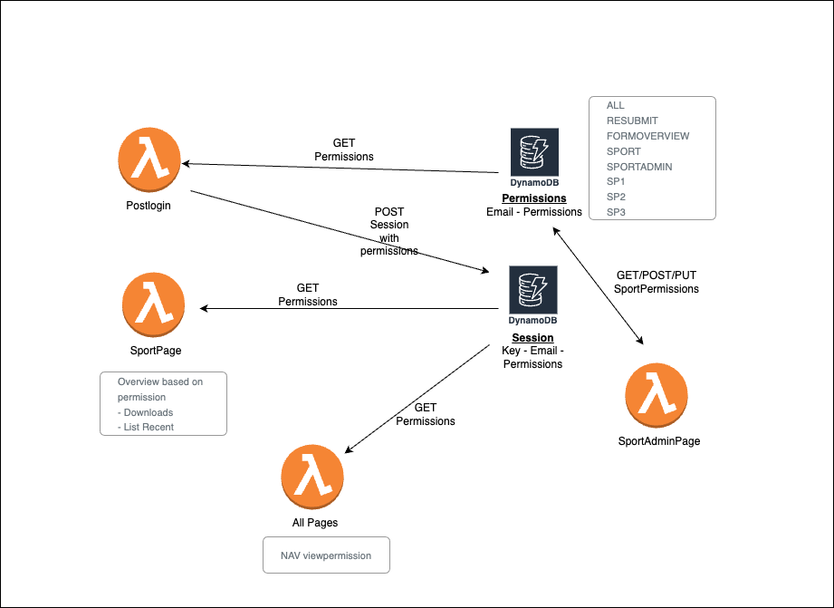
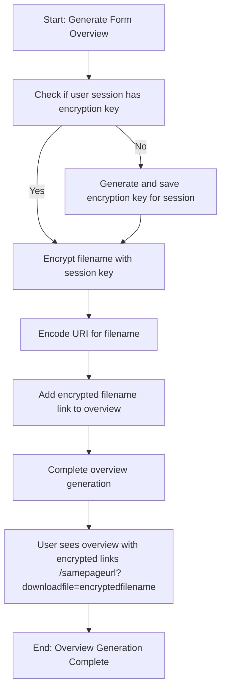
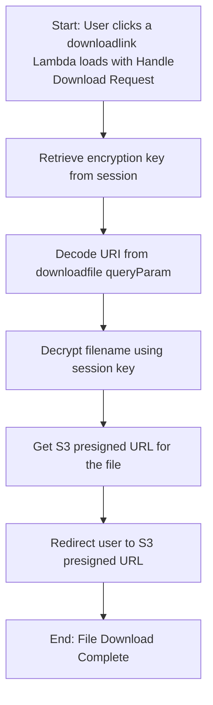
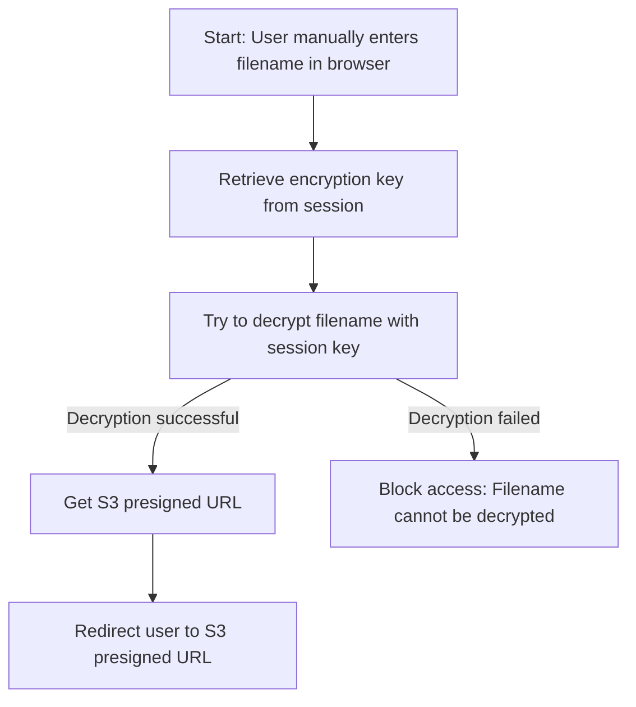

# Permissions

Not all users can view all pages. Permissions are needed to view pages and its navigation items.
Sports has more specific permissions. Please check the [sport page](./sport.readme) for more information.
Navigation is rendered based on the permissions

|   Name  	|  Permission  	|
|---	|---	|
| ADMIN  	|   Can view all pages	|
| RESBUMIT	|   Resubmit page	|
| FORMOVERVIEW 	| Form overview downloads   	|
|  SPORTADMIN 	| Can see all sport submissions in sport   	|
|   SP1 - SP7	| Can go to sport page, but will only see submissions and overviews that belong to the appid in the permission  	|

In postlogin the permissions are retrieved and saved in the user's session to be used on other pages.

## Download with permissions 

The lambda knows which file to download from a queryParam. For example: {baseUrl}/sport?downloadfile=nameofthefile.csv

### Problem without encrypting filename
This can become an issue when the user does not have permission to download that file. The user with permission SP1 does not see download options with SP6.

But if user with permission SP1 knows the filename to download and puts it in the queryParam, they can still download it.

Example: User with permission SP1 goes to {baseUrl}/sport?downloadfile=SP6-file.csv
The User should not be able to download it. But when the user puts the url directly in the browser they can without encryption.

To solve the problem we want User SP1 to only have access to files shown in the overviews. The overviews are generated based on the correct permissions.
To achieve the goal the filename is encrypted with a key from the User's session.

### Generate formoverview encryption steps

In overviewlambda in generateoverview
1. check if user session has encryption key - generate and save if there is no key
2. encrypt filename with key from session and filename EncryptFilename(key, filename)
3. encodeURI filename to make sure it can be used in an url
4. for each file, add a link in the overview with in < a > href="/currentpage?downloadfile={{encryptedFilename}}"
5. when clicked the same lambda is loaded with downloadfile param

In overviewlambda with downloadfile param
1. get encryption key from session
2. decodeURI the downloadfile queryParam
3. decrypt filename - this will only work with the key from the usersession
4. get s3 presigned url from /download
5. redirect to presigned url

With this encryption you cannot just put a known filename as a queryparam in your url. {baseUrl}/sport?downloadfile=SP6-specific-file.csv will not work because it is not encrypted.
Copying an encrypted url received from another user will not work either, because the encryptionkey will not match.

#### Generate overview with encrypted links

#### Deal with download link in overview clicked

#### Scenario to prevent unpermitted downloads

